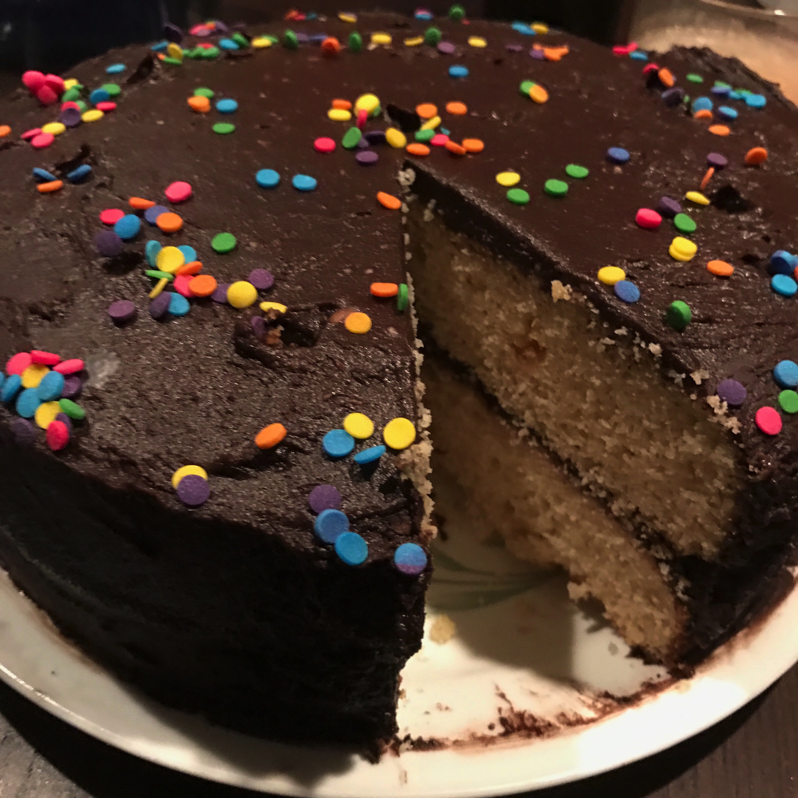

# Add things here

>This file is for demonstration purposes. You can add things to it and
then commit them and push them to the remote repository.

## Steps in the Git workflow

* (Pull)
* Modify
* Stage
* Commit
* Push

## Some words that programmers use as placeholders

* foo
* bar
* baz

## I made a cake

