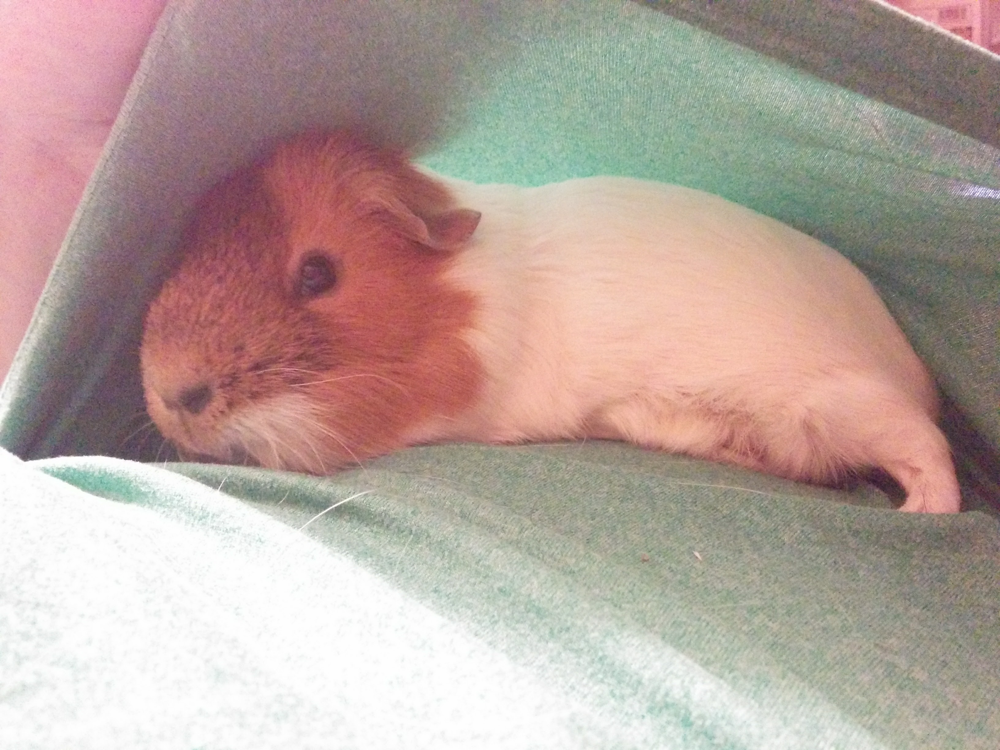
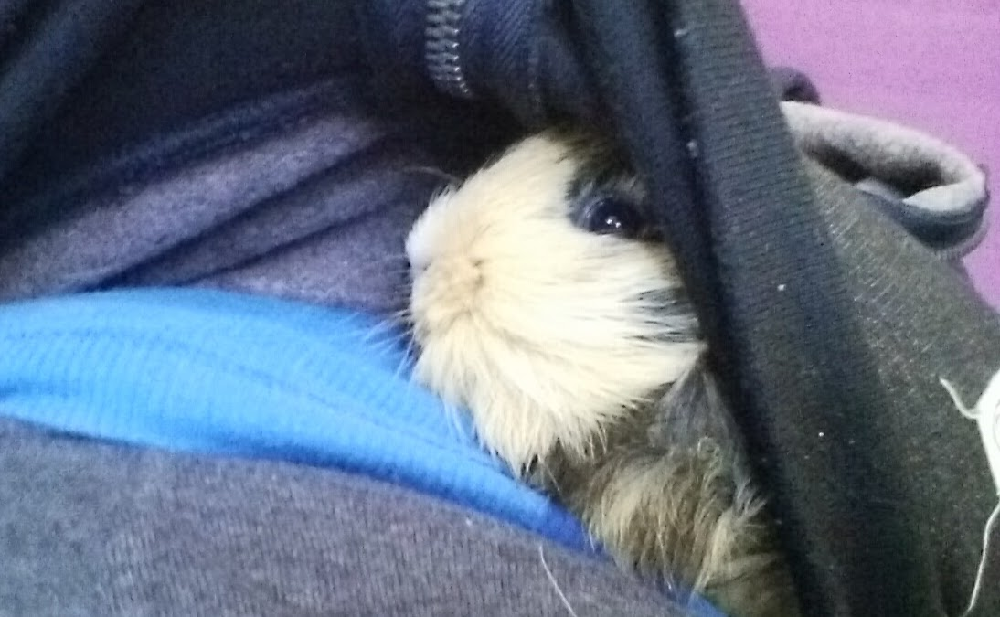
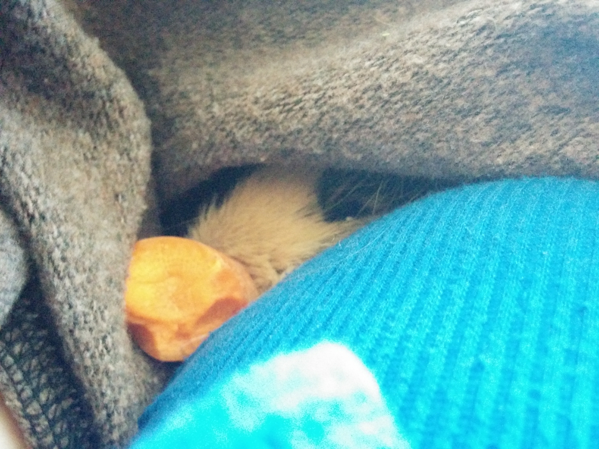
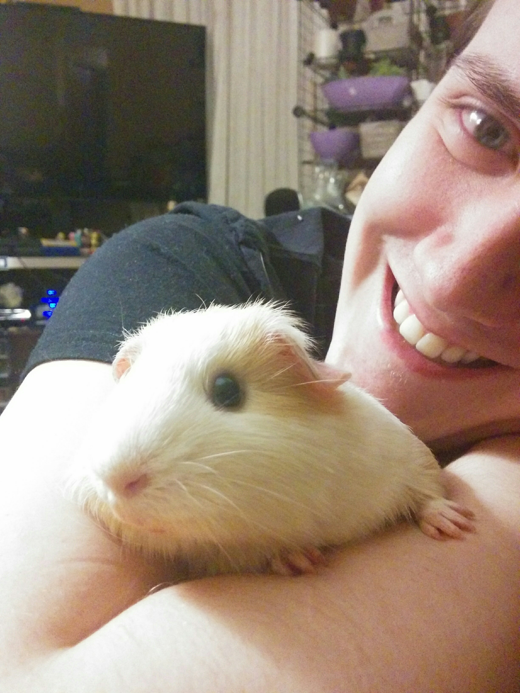

# Add things here
sdfsdafsdgsdgsderafaeesdfsdfd
>This file is for demonstration purposes. You can add things to it and
then commit them and push them to the remote repository.

## Steps in the Git workflow

* (Pull)
* Modify
* Stage
* Commit
* Push

## Some words that programmers use as placeholders

* foo
* bar
* baz

## My guinea pigs are really cute

### This is Zoe. She's really cute and she likes to snuggle in pockets and stuff:

### This is Zuka. She also likes to snuggle. You get two photos of her because she's mostly hidden:

### This is Marcie, short for Marceline but unofficially short for Toasted Marshmallow. She likes exploring more than snuggling. That's my boyfriend Mike holding her. He's also cute:

